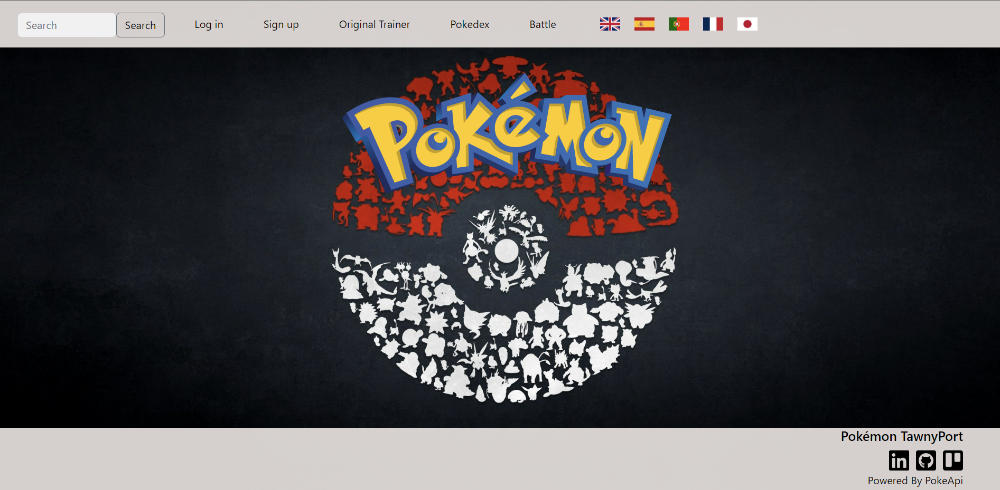

# Pokemon Tawny Port

IronHack Project 2 - [START YOUR ADVENTURE!](https://joaomiguelinacio.github.io/demon-slayer-dodging/)

## Introduction

Half way throught Ironhack's Web Development Bootcamp learning remains as fun as ever.

This second project marks the end of module two, where we first learnt about Handlebars, Node and Express, Databases, such as MongoDB, and APIs.

The challenge was to create a simple website with 2 models and 1 relationship, all CRUD operations and full authentication and authorization processes.

## The Idea

The initial idea was indeed simple: Using the @[PokeAPI](https://pokeapi.co/), I would render some views with the Pokémon details, some other views with the user's details and I would allow users to catch Pokémon adding them to their Pokémon collection.

But it wasn't long until I faced my first challenge: to pick a color for my application name when there are Pokémon games with the names of all the colors in the visible spectrum already!

I had decided to use Pokémon from the first Generation only and those games were the versions  `RED` and  `BLUE`, so whilst playing with color mixers online I got to  `TAWNY PORT`.

After making a quick google search to confirm that there wasn't a Pokémon  `TAWNY PORT` game, my decision was made and I could finally move on to less important things.
