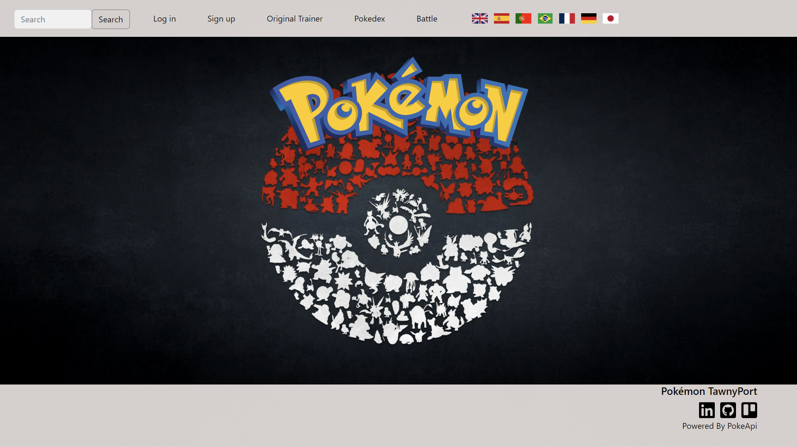
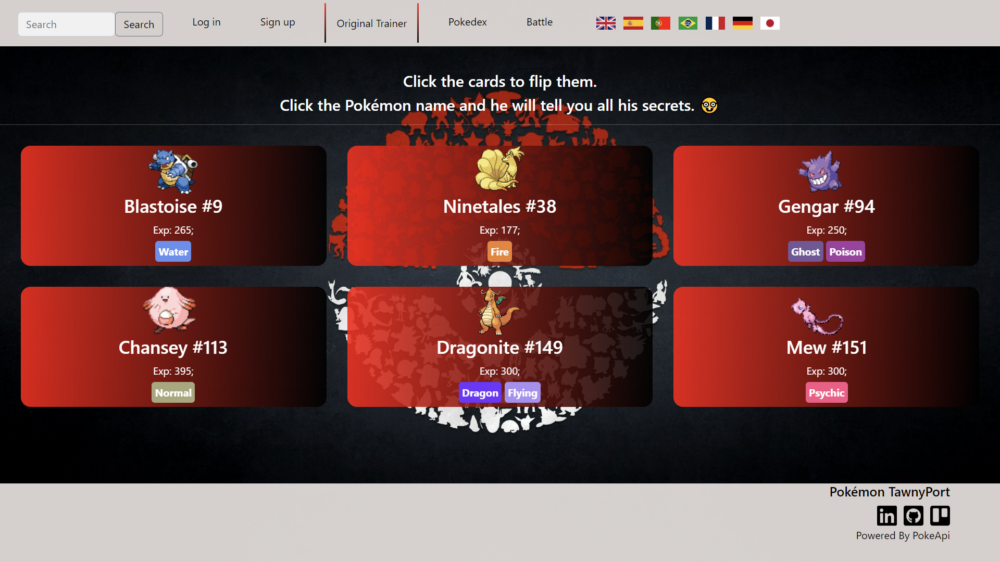
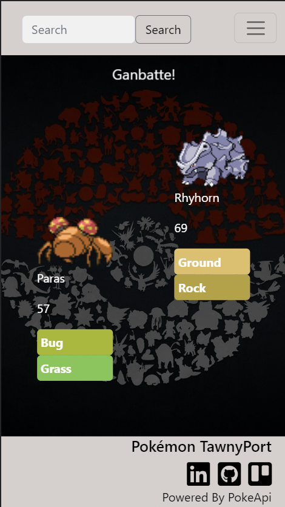
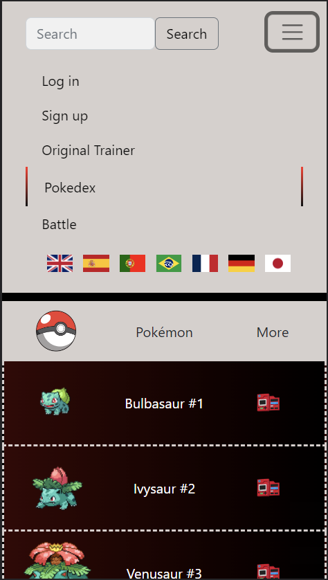
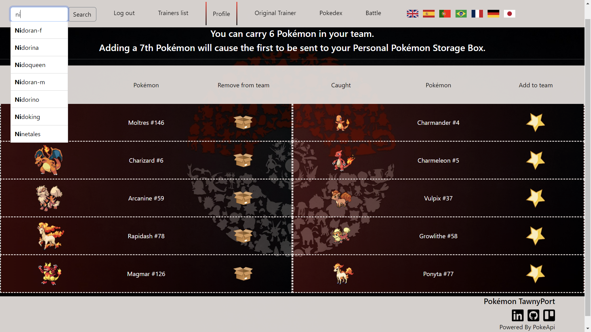

# Pokémon Tawny Port :wine_glass:

IronHack Project 2 - [START YOUR ADVENTURE!](https://joaomiguelinacio.github.io/demon-slayer-dodging/)



## Introduction :sunrise:

Half way through Ironhack's Web Development Bootcamp learning remains as fun as ever.

This second project marks the end of module two, where we first learnt about Handlebars, Node and Express, Databases, such as MongoDB, and APIs.

The challenge was to create a simple website with 2 models and 1 relationship, all CRUD operations and full authentication and authorization processes.

## The Idea :thought_balloon:

The initial idea was indeed simple: Using the [PokeAPI](https://pokeapi.co/), I would render some views with the Pokémon details, some other views with the user's details and I would allow users to catch Pokémon adding them to their Pokémon collection.

But it wasn't long until I faced my first challenge: to pick a color for my application name being that there are Pokémon games with the names of all the colors in the visible light spectrum already!

I had decided to use Pokémon from the first Generation only and those games were the versions RED and BLUE. Whilst playing with color mixers online, I got to TAWNY PORT.

After making a quick Google search to confirm that there wasn't a Pokémon TAWNY PORT game, my decision was made and I could finally move on to less important things.




## ES modules :anguished:

Speaking of Google searches, if you search for commonly used APIs, surely the PokeAPI will come up as one of them. Some authors will even refer to it as easy to use and beginner friendly so I thought I had hit the jackpot. 

During the bootcamp we had only used CommonJS module format but the [PokeAPI](https://pokeapi.co/) is now pure ESM.

So, I wrote my thoughts on the search bar and there it was: those same thoughts in the title of an article [What the heck is ESM?](https://dev.to/iggredible/what-the-heck-are-cjs-amd-umd-and-esm-ikm#:~:text=ESM%20stands%20for%20ES%20Modules,import%20React%20from%20'react'%3B).

I had chosen a name for my app so there was no way I could go back on my choice for API - I quickly regretted this.

## The PokeApi :persevere:

I believe everything I read on the Web and, after changing what looked like every single line of code from CJS to ESM, I was again holding on to the idea that The PokeApi was easy to use and beginner friendly.

The next day I realised that the info I wanted on the Pokémon was only obtainable using three different API methods and after days iterating through arrays, feeling a log more confident using the `map()`, `filter()` and `sort()` methods, I had an app that would take less than half an hour to render each view.

```javascript
  const pokemon = await MyPokedex.getPokemonByName(id);
  const pokemonSpecies = await MyPokedex.getPokemonSpeciesByName(id);
  async function findEvoChainId (pokemonSpecies) {
    if (pokemonSpecies.evolution_chain.url.charAt(43) !== "/") {
      const chainId = pokemonSpecies.evolution_chain.url.charAt(42)+pokemonSpecies.evolution_chain.url.charAt(43);
      const pokemonEvolutionChain = await MyPokedex.getEvolutionChainById(chainId);
      return pokemonEvolutionChain;
    } else {
      const chainId = pokemonSpecies.evolution_chain.url.charAt(42);
      const pokemonEvolutionChain = await MyPokedex.getEvolutionChainById(chainId);
      return pokemonEvolutionChain;
    }
  }
  const pokemonEvolutionChain = await findEvoChainId (pokemonSpecies);
  if (String(pokemonEvolutionChain.chain.evolves_to) === "" ){
    res.render('app/pokemon-details', {pokemon, pokemonSpecies} );
  } else {
    res.render('app/pokemon-details', {pokemon, pokemonSpecies, pokemonEvolutionChain} );
  }
```
    
```javascript
    const eggGroupPokemon = await MyPokedex.getEggGroupByName(id);
    const gen1Pokemon = await MyPokedex.getGenerationByName(1);
    const pokemonNamesInEggGroup = eggGroupPokemon.pokemon_species.map(pokemon => pokemon.name);
    const pokemonNamesInGen1 = gen1Pokemon.pokemon_species.map(pokemon => pokemon.name);
    const relevantPokemonNames = pokemonNamesInEggGroup.filter( name => pokemonNamesInGen1.indexOf(name) > -1);
    const pokemon = await MyPokedex.getPokemonByName(relevantPokemonNames);
```

## The Solution :expressionless:

Turns out seeding the database with data obtained using the API and using models made to measure, meeting all the data requirements my pages have, is not only much easier but it will also make the app much faster.

Come in, Mongo DB. The same as above, but different:

```javascript
const { id } = req.params;
const pokemonInArray = await Pokemon.find({ id: id });
const pokemon = pokemonInArray[0];
const evolutionChainPokemons = await Pokemon.find({
  name: pokemon.evolution_chain
});
```
```javascript
    const { id } = req.params;
    const pokemon = await Pokemon.find({ egg_groups: id });
```

## The Fun Begins :grin:

I was finally ready to dive back in into the world of Pokémon! And now, you can do the same!

- Anonymous Users can see the Original Trainer Profile, my team, the Pokedex and each Pokémon details. 
- Anonymous Users can sing along the iconic Pokémon season 1 theme in their preferred language.
- Anonymous Users can be transported back to the 90's when launching a random vs random Pokémon battle.


 


- Registered Users can catch Pokémon and build their own team, see who are the other trainers and see their teams.
- Registered Users can edit their profile and edit what Pokémon are on their team.

This is something I strongly advise them to do as Registered Users will also soon be able to choose one of the Pokémon in their team to battle random Pokémon and choose to battle other trainers on team of 6 vs team of 6 battles.

## Cool Stuff :star_struck:

- When signing up, if users don't upload any image, a Pokémon will be picked randomly to stand in for them.
- If the Pokémon has been caught by the User previously, then the User can't catch it again.
- Users will see search suggestions after typing the second character in the search bar. No need to have to have Bulbapedia open on a different tab worrying about making a typo!
- Users can carry 6 Pokémon in their team. If trying to add a 7th Pokémon then another will be removed from their team.
- Users can see the Pokémon in their team and all their other Pokémon in the same page and they are not repeated. This is despite the fact that all one User's Team Pokémon are also in that one User's Pokémon list in the database. 
- Did I mention that this app was designed using a mobile first approach?

#### From his team composition, can you guess what Pokémon this user is searching for to catch next?



## ~~Boring~~ Important Stuff :speak_no_evil:

### Models :dancing_women:

[User Model](https://github.com/joaoMiguelInacio/pokemon-tawny-port/blob/main/models/User.model.js)

```javascript
const userSchema = new Schema(
  {
    name: {...},
    image: {...},
    username: {...},
    description: {...},
    password: {...},
    pokemon: [{ type: Schema.Types.ObjectId, ref: "Pokemon" }],
    team: { 
      type: [{ type: Schema.Types.ObjectId, ref: "Pokemon" }],
      maxlength: 6
    }
  },
  {
    timestamps: true,
  }
);
```

[Pokémon Model](https://github.com/joaoMiguelInacio/pokemon-tawny-port/blob/main/models/Pokemon.model.js)

```javascript
const pokemonSchema = new Schema(
  {
    name: String,
    id: Number,
    base_experience: Number,
    types: [String],
    height: Number,
    weight: Number,
    habitat: String,
    growth_rate: String,
    sprites: {
      front_default : String,
      back_default: String,
      front_shiny: String,
      back_shiny: String,
      front_animated: String,
      back_animated: String
    },
    evolution_chain: [String],
    egg_groups: [String]
  },
  {
    timestamps: true,
  }
);
```

Pretty straight forward? Let me try changing your mind with [this](https://github.com/joaoMiguelInacio/pokemon-tawny-port/blob/main/seeds/pokemon.seed.js)!

### Routes :motorway:

[Index Routes](https://github.com/joaoMiguelInacio/pokemon-tawny-port/blob/main/routes/index.routes.js) | HTTP Verb| Description  | View
------------- | ------------- | ------------- | -------------
/  | GET  | Shows Home Page  | index

[Auth Routes](https://github.com/joaoMiguelInacio/pokemon-tawny-port/blob/main/routes/auth.routes.js)  | HTTP Verb| Description  | View
------------- | ------------- | ------------- | -------------
/signup  | GET  | Shows Sign Up form | auth/signup
/signup  | POST  | Creates New User and Redirects to: | / (Home Page)
/login  | GET  | Shows Login form | auth/login
/login  | POST  | Logs User In and Redirects to: | / (Home Page)
/logout  | GET  | Logs User Out and Redirects to: | / (Home Page)

[App Routes](https://github.com/joaoMiguelInacio/pokemon-tawny-port/blob/main/routes/app.routes.js) | HTTP Verb| Description  | View
------------- | ------------- | ------------- | -------------
/original-trainer-profile  | GET  | Shows Original Trainer Profile  | app/original-trainer-profile
/original-trainer-team  | GET  | Shows Original Trainer Team  | app/original-trainer-team
/pokedex  | GET  | Shows Pokedex  | app/pokedex
/pokemon-search  | GET  | Redirects to:  | /app/pokemon-details/${searchedPokemonId}
/pokemon-details/  | GET  | Shows Error View  | app/pokemon-search-unsuccessful
/pokemon-details/:id  | GET  | Shows Pokémon details  | app/pokemon-details
/pokemon-by-egg-group-list/:id  | GET  | Shows all Pokémon of the Egg Group  | app/pokemon-by-egg-group-list
/own-profile  | GET  | Shows own Profile  | app/own-profile
/own-profile-edit  | GET  | Shows form to edit own Profile  | app/own-profile-edit
/own-profile-edit  | POST  | Redirects to:  | own-profile
/catch-pokemon/:id | GET  | Redirects to:  | /app/own-pokemon-team
/own-pokemon-team | GET  | Shows own Pokémon Team  | app/own-pokemon-team
/own-pokemon-team-edit/ | GET  | Shows own Pokémon Team and own Pokémon | app/own-pokemon-team-edit
/own-pokemon-team-edit-add/:id | POST  | Redirects to: | app/own-pokemon-team-edit
/own-pokemon-team-edit-remove/:id | POST  | Redirects to: | app/own-pokemon-team-edit
/trainer-list | GET  | Shows all trainers | app/trainer-list
/trainer-profile/:id | GET  | Shows a specific trainer's profile | app/trainer-profile
/trainer-team/:id | GET  | Shows a specific trainer's team | app/trainer-team
/battle | GET  | Starts a battle | app/battle


## Backlog :tired_face:

Because on top of coding I have a 37.5h/week part-time job, this will have to wait:

- [ ] Fix whatever bug is wrong with Axios;
- [ ] Allow 1 own Pokémon vs random Pokémon battles;
- [ ] Allow trainer (6 vs 6) battles;
- [ ] Change battle winner algorithm so that types influence the outcome;
- [ ] Add level to User.model being that this increases with each battle won;
- [ ] Limit what Pokémon users can catch depending on their level.
- [ ] :wine_glass:

## Additional Links :relieved:

[Trello](https://trello.com/b/IiltWmB0/project-2-pokeapi)
